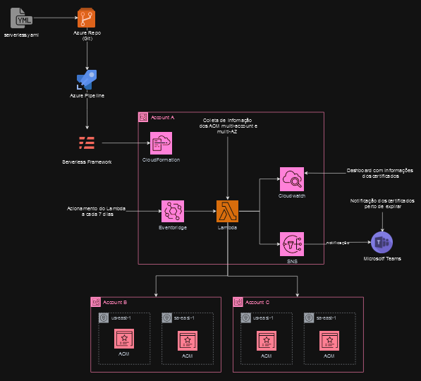

# Listagem de Certificados ACM.



## Objetivo:
Esse projeto tem como intuito fazer auditoria de certificados do ACM de todas as contas de uma organização na AWS em um único board do Cloudwatch.

## Recursos utilizados:
* Lambda;
* SNS;
* CloudWatch;
* EventBridge;
* ACM Certificate;
* IAM Roles.

## Metodo de funcionamento:
Criar um lambda em com Python utilizando as bibliotecas do boto3, onde o mesmo faz a listagem de certificados ao ser trigado. O código também tem como função fazer controle de certificados que estão próximos de seu vencimento, para que seja tomado alguma providencia, para isso quando trigado o lambda dispara um evento para o MicrosoftTeams avisando que os certificados com vigência menor que 60 dias estão vencendo. Há um EventBrigde que irá trigar esse lambda de 7 em 7 dias.
Ao trigar o lambda será exibido em seus logs em formato de tabela, todos os certificados, contendo o numero da conta, a região, domínio, data de expiração e os recursos atrelados a ele. Com isso, um board do Cloudwatch irá consumir esses dados e listá-los, dando visibilidade dos certificados e suas respectivas informações.

## Processo de criação
Deve-se rodar os seguintes comandos.

### Pré requisitos
Docker \
AWS CLI \
AWS SAM CLI \
Bucket S3

### Comandos para execução da stack template.yml
*Buildar o SAM em um container*
```bash
sam build --use-container
```

*Enviar o arquivo de build para um bucket s3*
```bash
sam package --output-template-file packaged.yaml --s3-bucket (bucket-name) --region us-east-1
```

*Deploy na AWS*
```bash
sam deploy --template-file packaged.yaml --stack-name acm-list --capabilities CAPABILITY_NAMED_IAM --region us-east-1
```

*Deletar Stack*
```bash
sam delete --stack-name acm-list --region us-east-1
```

### Comandos para execução da stack createRole-Certificate-ACM.yaml
Esse processo deve-se a criação da role a ser assumida pelo lambda

*Criar a Stack*
```bash
aws cloudformation create-stack-set --stack-set-name Create-Role-Project-Certificate-ACM --capabilities CAPABILITY_NAMED_IAM \
--template-body file://createRole-Certificate-ACM.yaml --region us-east-1 --permission-model SERVICE_MANAGED --auto-deployment Enabled=true,RetainStacksOnAccountRemoval=false
```

*Executar a Stack*
```bash
aws cloudformation create-stack-instances --stack-set-name Create-Role-Project-Certificate-ACM --deployment-targets OrganizationalUnitIds=(organization-id) --regions us-east-1
```

*Deletar a Stack*
```bash
aws cloudformation delete-stack-set --stack-set-name Create-Role-Project-Certificate-ACM --region us-east-1
```

